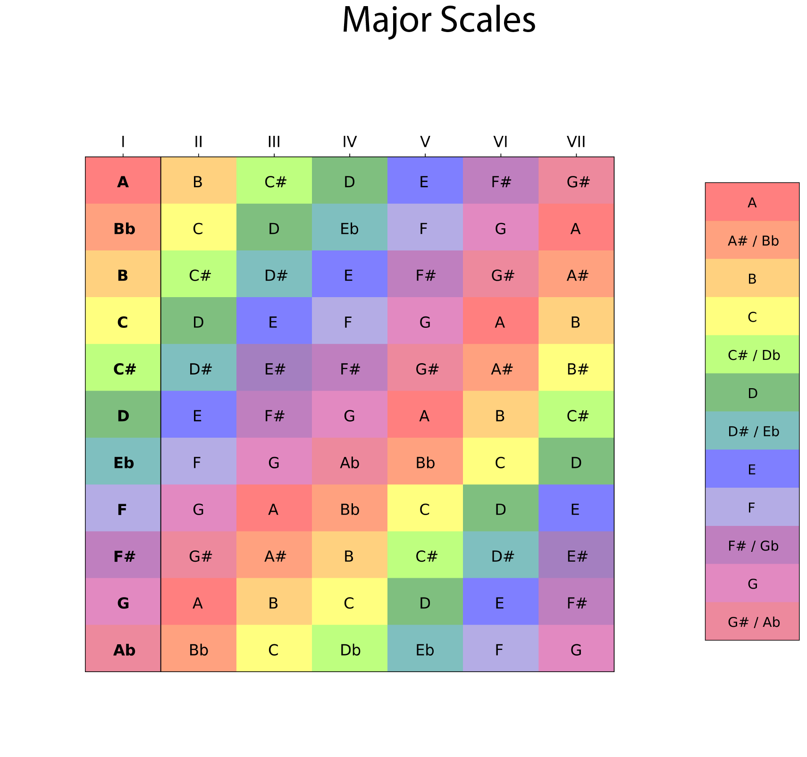

### palm

Polygenic Adaptation Likelihood Method. This method uses genealogy sampling (i.e. <a href = "https://myersgroup.github.io/relate/">Relate</a>) and GWAS summary statistics to estimate selection on polygenic traits. It can be used to test multiple traits jointly for direct selection & correlated response. 

PALM is on <a href = "https://github.com/35ajstern/palm">Github</a>. 

### clues 

Coalescent Likelihood Under Effects of Selection (clues). This is a software package (actively developed and documented) for estimating the likelihood of selection, the selection coefficient, and changes in allele frequency over time. The method broadly works by using the results of pre-existing methods for estimating/sampling local genealogies (i.e., <a href = "https://myersgroup.github.io/relate/">Relate</a>). These trees are then ran through our importance sampling algorithm. We use a HMM to infer selection coefficients and allele frequency trajectories, including ancient samples/genotype likelihoods. 

CLUES is on <a href = "https://github.com/35ajstern/clues">Github</a>.

#### clues-v0

We also have an older version of this method <a href = "https://github.com/35ajstern/clues-v0">CLUES-v0</a> that uses the MCMC method <a href = "https://github.com/mjhubisz/argweaver">ARGweaver</a> to sample local genealogies.

### Major scales plots

I wrote a program to make color-coded plots of major musical scales in Python: <a href = "https://github.com/35ajstern/MajorScalesPlots">MajorScalesPlots</a>.

 

